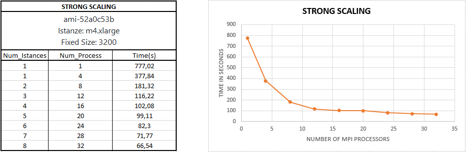
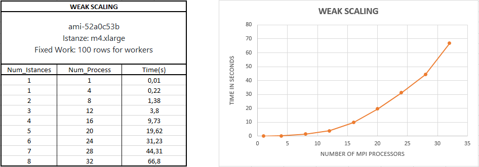

# MatrixMultiplication MPI Solutions

###  INDICE
  * Soluzione
  * Strong Scaling
  * Weak Scaling
  * Compilazione

### Soluzione
La soluzione da me proposta prevede che il programma, inizialmente alloca in modo dinamico le matrici A e B e le inizializza in modo casuale (con lo stesso seme). Successivamente il master calcola gli indici delle sottomatrici che ogni processore deve elaborare. Questo calcolo viene effettuato dividendo la taglia della matrice per il numero totale dei processori, ottenendo il numero di righe che ogni processore deve calcolare, poi viene fatto il modulo tra la taglia della matrice e il numero totale dei processori, (perché potrebbero esserci delle righe extra quando la taglia della matrice non è divisibile per il numero di processori) e la computazione di queste viene assegnata ai primi processori. Invia gli indici ai vari processori, poi alloca in modo dinamico la matrice C e la inizializza a 0 e svolge il suo carico di lavoro (poiché anche il master ha i propri indici da elaborare). Infine riceve le sottomatrici della matrice C da ogni processore e le inserisce nella matrice. Il lavoro degli slave prevede, che ricevano gli indici dal master, effettuano la computazione della propria sottomatrice e la inviano al master sotto forma di vettore.

### Strong Scaling

Questo test è stato effettuato su un numero crescente di istanze (da 1 a 8)   StarCluster AMI ami-52a0c53b (Linux Ubuntu), dove per ogni istanza sono stati aggiunti 4 processori in più ad ogni run, e la taglia della matrice è stata fissata a 3200(righe x colonne).



I risultati di questo test soddisfano in pieno le aspettative poiché all' aumentare del numero di processori il tempo di computazione diminuisce, questo perché ognuno ha meno carico di lavoro da computare.  

### Weak Scaling

Questo test è stato effettuato su un numero crescente di istanze (da 1 a 8)   StarCluster AMI ami-52a0c53b (Linux Ubuntu), dove per ogni istanza sono stati aggiunti 4 processori in più ad ogni run, e il carico di lavoro è stato fissato a 100 righe per ogni processore. 



Come si può notare dal grafico, pur mantendendo il lavoro fissato per ogni processore, il tempo di esecuzione aumenta, questo perché il problema maggiore è rappresentato dalla comunicazione su rete.

### Compilazione

Per eseguire il programma è sufficiente eseguire 2 passi:
 ```
1  mpicc mpi_matrixmultiplication.c -o matrix_m
 ```
  ```
2  mpirun -np "number_processors" --host IPHOST1,....,IPHOSTN matrix_m
 ```
# Matrix-Multiplication
